<!--
  Profile README for Shivangdubey049
  Repo name must be exactly: Shivangdubey049
  Files: README.md, assets/terminal.svg, .github/workflows/snake.yml
-->


<div align="center">



<br/><br/>

[](https://www.linkedin.com/in/shivangdubey049)
[](https://www.instagram.com/shivangdubeyy)
[](https://x.com/Shivangdubey049)


</div>


## ⚡ `OPERATOR FILE`

```text
╔══════════════════════════════════════════════════════════╗
║ SHIVANG // OPERATOR FILE                                 ║
╠══════════════════════════════════════════════════════════╣
║ OPERATOR    Shivang Dubey  (@Shivangdubey049)            ║
║ CLASS       B.Tech CSE (AI/ML) · Year 3                  ║
║ BASE        Ghaziabad, India                             ║
║ SPECIALITY  Pentesting · Network Security · Analysis     ║
║ MISSION     SIH26153 · OracleShield · NTRO               ║
║ CODE        Python · C · Java · TypeScript               ║
║ RULES       Authorised targets only                      ║
║ STATUS      ● ONLINE — learning in public                ║
╚══════════════════════════════════════════════════════════╝
```

## 🎯 `SKILL MATRIX`

| Domain | What I'm working on | Status |
|---|---|---|
| 🕵️ **Reconnaissance** | Nmap scanning, service enumeration, OSINT basics | 🟡 Learning |
| 🌐 **Network Analysis** | Wireshark, traffic patterns, intrusion detection data | 🟢 Active |
| 🧨 **Web App Pentesting** | Burp Suite, OWASP Top 10 labs | 🟡 Learning |
| 🤖 **AI for Cyber Defence** | LSTM attack forecasting, RandomForest detection | 🟢 Active |
| 🗺️ **Threat Modelling** | MITRE ATT&CK stage mapping, risk estimation | 🟢 Active |
| ⛓️ **Audit & Integrity** | SHA-256 hash-chained tamper-evident logging | 🟢 Active |
| 🏴 **CTFs & Labs** | TryHackMe / Hack The Box, write-ups | 🔵 Next up |

<sub>🟢 Active &nbsp;·&nbsp; 🟡 Learning &nbsp;·&nbsp; 🔵 Planned</sub>

### 🔗 Kill chain I'm training across

<div align="center">


</div>

## 🧰 `TOOLKIT`

<div align="center">


</div>


## 🛡️ `FLAGSHIP // ORACLESHIELD`

<div align="center">

[](https://github.com/Shivangdubey049/OracleShield)

**SIH26153 · National Technical Research Organisation (NTRO)**

</div>

> **Traditional IDS:** *what attack is happening now?*
> **OracleShield:** *given the network state now, where will the threat move next?*

```text
                 ┌──────────────┐
  Network  ───►  │ State  S_t   │
  Traffic        └──────┬───────┘
                 ┌──────┴────────────────┐
                 ▼                       ▼
        ┌────────────────┐     ┌───────────────────┐
        │ RandomForest   │     │ LSTM World Model  │
        │ detection      │     │ P(S_t+1 | S_t…)   │
        └───────┬────────┘     └─────────┬─────────┘
                └───────────┬────────────┘
                            ▼
                 Forward state rollout
                            ▼
              Risk estimate ─► MITRE ATT&CK stage
                            ▼
              SHA-256 audit chain ─► Streamlit SOC UI
```

<details>
<summary><b>🔍 What it does (click to expand)</b></summary>

<br/>

- 🔮 **World model:** an LSTM predicts the next network state and the attack-stage distribution
- 🧠 **Threat memory:** persistent prototypes for recurring attacker trajectories
- 🗺️ **ATT&CK mapping:** probe → Reconnaissance, r2l → Initial Access, u2r → Privilege Escalation, dos → Impact
- ⛓️ **Tamper-evident ledger:** non-benign events go into a SHA-256 hash chain, with a live tamper demo in the UI
- 📊 **Honest evaluation:** NSL-KDD (148,517 records) with macro precision, recall and F1, not accuracy alone
- 🧪 **Next step:** timestamped telemetry (CIC-IDS2018 / CTU-13) for real attacker-progression timelines

</details>


## 🗂️ `OTHER BUILDS`

<div align="center">

[](https://github.com/Shivangdubey049/autoattendify)
[](https://github.com/Shivangdubey049/carbon-wise-commute)

[](https://github.com/Shivangdubey049/curivo)

</div>

| Project | Note |
|---|---|
| 🗓️ **[autoattendify](https://autoattendifyy.vercel.app)** | Next.js + TypeScript web app built for SIH 2025, live on Vercel |
| 🌱 **carbon-wise-commute** | React + TypeScript + Supabase app for greener commuting |
| 🧠 **curivo** | My first project: a mental-health-focused web app |


## 📡 `TELEMETRY`

<div align="center">


</div>

## 🗺️ `MISSION ROADMAP // 2026`

<details open>
<summary><b>🏴 Offensive security</b></summary>

<br/>

- [ ] Finish TryHackMe: Pre-Security → Jr Penetration Tester
- [ ] Complete 20+ rooms or machines on TryHackMe / Hack The Box
- [ ] Get fluent with Nmap, Wireshark and Burp Suite on lab targets
- [ ] Play beginner CTFs and publish write-ups in a `ctf-writeups` repo
- [ ] Prepare for a junior pentest certification (eJPT or similar)

</details>

<details open>
<summary><b>🔬 Security analysis</b></summary>

<br/>

- [ ] Build a documented home lab (Kali + intentionally vulnerable VMs)
- [ ] Learn log analysis and core SIEM concepts
- [ ] Map findings to MITRE ATT&CK and the OWASP Top 10

</details>

<details open>
<summary><b>🚀 Build &amp; ship</b></summary>

<br/>

- [ ] Upgrade OracleShield with timestamped telemetry
- [ ] Add polished READMEs and screenshots to every project
- [ ] Make my first open-source contribution to a security tool

</details>


<div align="center">

### 📬 Let's connect

Working on security, AI or SIH-style projects? Open to CTF teammates, study partners and collaboration.
[**LinkedIn**](https://www.linkedin.com/in/shivangdubey049) &nbsp;·&nbsp; [**X**](https://x.com/Shivangdubey049) &nbsp;·&nbsp; [**Instagram**](https://www.instagram.com/shivangdubeyy)

<br/>

> ⚠️ **Ethical hacking only.** I practise on labs, CTFs and systems I own or have written permission to test.

⭐ **Building OracleShield for SIH26153 (NTRO). If you like AI-driven cyber defence, star the repo and follow along.**


</div>
